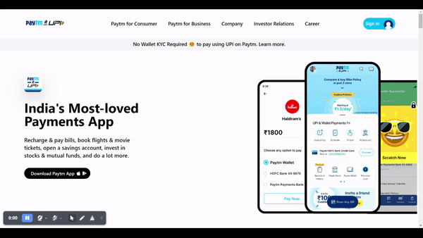
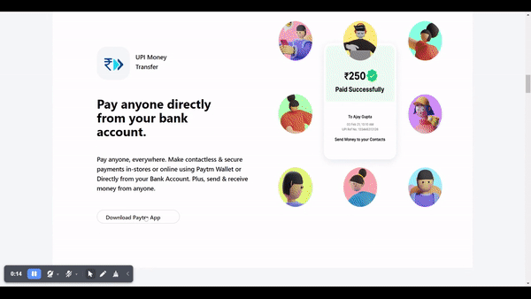
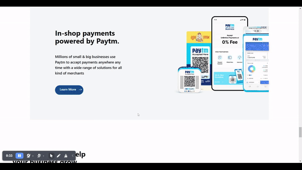

# Paytm clone using Tailwind-CSS

---

- This project is a part of the Full Stack Javascript Web Developer Bootcamp by iNeuron.
- This is a Clone of a popular Indian SAAS Business Paytm.
- India's Most-loved Payments App
  Recharge & pay bills, book flights & movie tickets, open a savings account, invest in stocks & mutual funds, and do a lot more.
- Technologies used to design this page

  

  

  
MOBILE RESPONSIVE

- Well `Tailwind-CSS` is the first `CSS Framework` I have ever learnt.

## Learnings

- I watched a lot of videos on how to get started with `Tailwind-CSS`
- After getting some of the basics I dived straight into the project where I had to clone India's Most Loved Payments App Website
- I have also made the webpage in mobile view.
- I made the webpage over three day's time and learned a lot about the popular framework `Tailwind-CSS`
- The webpage itself was pretty lenghty and took me almost **12-14 Hours** to complete over three to four days

## Made By Punit Bathija
